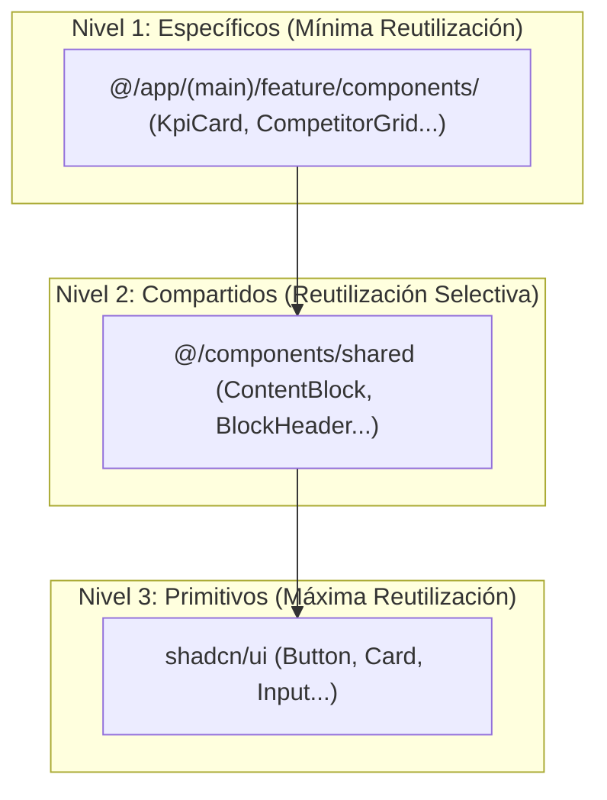

# Documento de Arquitectura y Decisiones (ADR) - Amplify AI

*Última actualización: Refactorización completa de la arquitectura para desacoplar Frontend y Backend, y definición del stack tecnológico Full-Stack.*

## 1. Filosofía y Visión General

Este documento describe la arquitectura full-stack del proyecto Amplify AI. La filosofía principal es la **separación de responsabilidades** entre un frontend Next.js de alto rendimiento y un backend de API robusto y escalable, permitiendo un desarrollo en paralelo y una integración limpia.

*   **Frontend (Next.js):** Actúa como la capa de presentación. Es responsable de la experiencia de usuario, la renderización de la interfaz y la gestión del estado de la UI. **No contiene lógica de negocio crítica**.
*   **Backend (FastAPI):** Actúa como el cerebro del sistema. Centraliza toda la lógica de negocio, la comunicación con la base de datos, la gestión de usuarios y la integración con servicios de terceros.

---

## 2. Arquitectura Full-Stack

### 2.1. Diagrama de Arquitectura Global

```mermaid
graph TD
    subgraph "Usuario Final"
        A[Navegador del Usuario]
    end

    subgraph "Plataforma Frontend (Vercel/Render)"
        B[Next.js App]
        B -- HTTPS --> C
    end

    subgraph "Plataforma Backend (Render/Fly.io)"
        C[API de FastAPI]
        C -- Conexión Segura --> D
        C -- Webhooks/API --> E
    end

    subgraph "Servicios de Terceros"
        D[Supabase: DB (Postgres) + Auth + Storage]
        E[Stripe: Pagos y Suscripciones]
    end

    A --> B
```

### 2.2. Stack Tecnológico Detallado

| Capa      | Tecnología        | Propósito                                       |
|-----------|-------------------|-------------------------------------------------|
| **Frontend**  | Next.js 15 (App Router) | Framework de React para UI y renderizado.       |
|           | TypeScript        | Tipado estático para robustez.                  |
|           | Tailwind CSS      | Estilos a través de clases de utilidad.         |
|           | shadcn/ui         | Componentes de UI accesibles y personalizables. |
|           | Zustand           | Gestión de estado global simple (si es necesario). |
|           | Testing Library   | Pruebas de componentes y UI.                    |
| **Backend**   | Python 3.11+      | Lenguaje principal.                             |
|           | FastAPI           | Framework de API de alto rendimiento.           |
|           | Pydantic          | Validación de datos y "contrato" de API.        |
|           | SQLAlchemy        | ORM para la interacción con la base de datos.   |
|           | Pytest, Black, Mypy | Calidad, formato y tipado del código.           |
| **Base de Datos** | Supabase (PostgreSQL) | Base de datos relacional gestionada.        |
| **Autenticación** | Supabase Auth     | Gestión de usuarios (Social, Email/Pass). |
| **Almacenamiento** | Supabase Storage  | Almacenamiento de archivos y assets.       |
| **Pagos**     | Stripe            | Procesamiento de pagos y suscripciones.       |
| **CI/CD**     | GitHub Actions    | Automatización de pruebas y despliegues.      |
| **Hosting**   | Vercel/Render/Fly.io | Plataformas para el despliegue de servicios.  |

---

## 3. Arquitectura del Frontend (Next.js)

El frontend sigue un patrón moderno que prioriza el rendimiento y la mantenibilidad.

### 3.1. Flujo de Renderizado y Datos (Patrón de Servicio)

La decisión arquitectónica clave es la **abstracción de la capa de datos** a través de un "Service Layer".

1.  **Server Component (`/app/(main)/**/page.tsx`):**
    *   Una página es, por defecto, un **React Server Component (RSC)**.
    *   Su única responsabilidad es **orquestar la obtención de datos** para la carga inicial.
    *   Llama a una función del **Service Layer** (ej. `getDashboardData()`).
    *   **No contiene JSX de presentación complejo**.
    *   Pasa los datos obtenidos como `props` a un Client Component.

2.  **Service Layer (`/lib/services/*.ts`):**
    *   Este es el **único lugar** donde se define cómo obtener datos.
    *   Cada servicio (ej. `dashboardService.ts`) exporta funciones asíncronas (ej. `getDashboardData`).
    *   **Actualmente**, estas funciones leen de los `mock-data`.
    *   **En el futuro**, estas funciones harán una llamada `fetch` al endpoint correspondiente de la API de FastAPI.
    *   Este patrón asegura que si el backend cambia, **solo necesitamos actualizar el servicio**, no los componentes.

3.  **Client Component (`/app/(main)/**/components/*ClientPage.tsx`):**
    *   Marcado con `"use client"`.
    *   Recibe los datos iniciales como `props`.
    *   **Contiene toda la interactividad**: estado (hooks), manejadores de eventos, y renderizado de la UI.
    *   Si necesita realizar una **mutación** (Crear, Actualizar, Borrar), llama a funciones de un servicio (ej. `postService.updatePost()`) que a su vez harán la llamada `POST`, `PUT`, o `DELETE` a la API de FastAPI.

### 3.2. Estructura de Directorios Clave

-   `app/(main)/*`: Rutas principales de la aplicación.
    -   `page.tsx`: El Server Component que carga los datos.
    -   `components/*ClientPage.tsx`: El Client Component que renderiza la UI.
    -   `components/*`: Otros componentes específicos de esa sección.
-   `lib/services`: La capa de abstracción de datos. El punto de integración con el Backend.
-   `lib/mock-data`: Datos simulados para desarrollo desacoplado.
-   `lib/types.ts`: Definiciones de tipos de TypeScript compartidas.

### 3.3. Estructura de Componentes (La Pirámide)

Para mantener el código organizado, escalable y con un bajo acoplamiento, los componentes se organizan en una jerarquía de tres niveles, conocida como "La Pirámide de Componentes". La regla principal es: **un componente debe residir en el nivel más específico posible**.



**Nivel 1: Componentes Específicos de Feature (`/app/(main)/[feature]/components/`)**
- **Definición:** Son componentes que están fuertemente acoplados a una única funcionalidad o página de la aplicación.
- **Ejemplos:** `KpiCard` (solo para `analytics`), `CompetitorGrid` (solo para `strategy-coach`).
- **Regla:** Si un componente solo se usa dentro de una *feature*, **DEBE** vivir en el directorio `components` de esa *feature*.

**Nivel 2: Componentes Compartidos (`/components/shared/`)**
- **Definición:** Componentes de composición que son reutilizados en **al menos dos features distintas**.
- **Ejemplos:** `ContentBlock` (usado en Dashboard, Analytics, etc.), `PageHeader`.
- **Regla:** Un componente solo se puede "promocionar" a `shared` cuando se demuestra su necesidad en una segunda *feature*. No se deben crear componentes compartidos de forma especulativa.

**Nivel 3: Componentes Primitivos de UI (`/components/ui/`)**
- **Definición:** Son los bloques de construcción básicos y sin lógica de negocio, proporcionados por la librería `shadcn/ui`.
- **Ejemplos:** `Button`, `Card`, `Input`, `Dialog`.
- **Regla:** Estos componentes son la base de todos los demás. Se utilizan para construir componentes de Nivel 1 y Nivel 2.

### 3.4. Sistema de Diseño (Design Tokens)

Para asegurar la consistencia visual y facilitar el mantenimiento, la aplicación utiliza un sistema de Design Tokens centralizado.

-   **Fuente de la Verdad (Valores):** El archivo `app/globals.css` define todas las variables CSS para los colores, fuentes y radios de la aplicación. Crucialmente, contiene las definiciones para el tema claro (`:root`) y oscuro (`.dark`), permitiendo un theming robusto.

-   **Integración con Tailwind CSS:** El archivo `tailwind.config.ts` consume estas variables CSS. En lugar de valores harcodeados, la configuración del tema de Tailwind apunta a estas variables.
    -   *Ejemplo:* `colors: { primary: 'var(--primary)' }`

-   **Uso en la Práctica:** Los desarrolladores deben utilizar exclusivamente las clases de utilidad de Tailwind (ej. `bg-primary`, `text-foreground`, `border-border`) en los componentes. Esto desacopla los componentes de los valores de diseño específicos, permitiendo que un cambio en una variable CSS en `globals.css` se propague por toda la aplicación de manera consistente.

### 3.5. Arquitectura de Autenticación (`/app/(auth)`)

La autenticación no es solo una característica, sino un contexto arquitectónico distinto dentro de la aplicación.

-   **Layout de Grupo Dedicado:** Se utiliza un [Layout de Grupo](https://nextjs.org/docs/app/building-your-application/routing/route-groups) de Next.js, `(auth)`, para las páginas relacionadas con la autenticación (ej. `/login`, `/register`, `/forgot-password`). Este grupo tiene su propio `layout.tsx` que **NO** incluye los componentes del "Application Shell" como la `Sidebar` o el `Header`. Esto crea un entorno limpio y enfocado para el usuario.

-   **Páginas Orquestadoras:** Cada página dentro de `(auth)`, como `login/page.tsx`, actúa como un orquestador que compone la interfaz a partir de componentes de UI y, si es necesario, componentes de módulo más complejos.

-   **Componentes de Módulo Específicos:** Siguiendo el Nivel 1 de la "Pirámide de Componentes", la lógica visual compleja se aísla en su propio componente. Un ejemplo clave es `components/auth/OrbitalShowcase.tsx`, que encapsula toda la animación 3D de la página de login, manteniendo el archivo de la página limpio y enfocado en el estado y la lógica del formulario.

---

## 4. Arquitectura del Backend (FastAPI)

El backend está diseñado para ser un monolito de API limpio, seguro y fácil de mantener.

### 4.1. Responsabilidades

*   **Endpoints de API:** Expone una API RESTful documentada automáticamente (gracias a FastAPI y Pydantic) para que el frontend la consuma.
*   **Lógica de Negocio:** Centraliza todas las reglas de negocio (ej. cómo se calcula una métrica, qué implica una suscripción, etc.).
*   **Autenticación y Autorización:** Valida los tokens de JWT (generados por Supabase Auth) en cada petición protegida.
*   **Interacción con la Base de Datos:** Es el único componente del sistema que puede comunicarse directamente con la base de datos de Supabase.
*   **Integración Segura con Terceros:** Gestiona las claves secretas y la comunicación con servicios como Stripe.

### 4.2. Flujo de una Petición Autenticada

1.  El usuario inicia sesión en el frontend. El cliente de Supabase en el frontend gestiona el flujo de OAuth/contraseña y recibe un **JWT (JSON Web Token)**.
2.  Para cada llamada a un endpoint protegido, el frontend Next.js añade este JWT al encabezado `Authorization: Bearer <token>`.
3.  La API de FastAPI recibe la petición y, a través de una `Dependency`, valida el JWT con las claves públicas de Supabase.
4.  Si el token es válido, extrae el `user_id` y procesa la petición.
5.  Si el token no es válido, devuelve un error `401 Unauthorized`.

Este flujo asegura que la API es **stateless** y que cada endpoint puede protegerse de forma individual y robusta. 