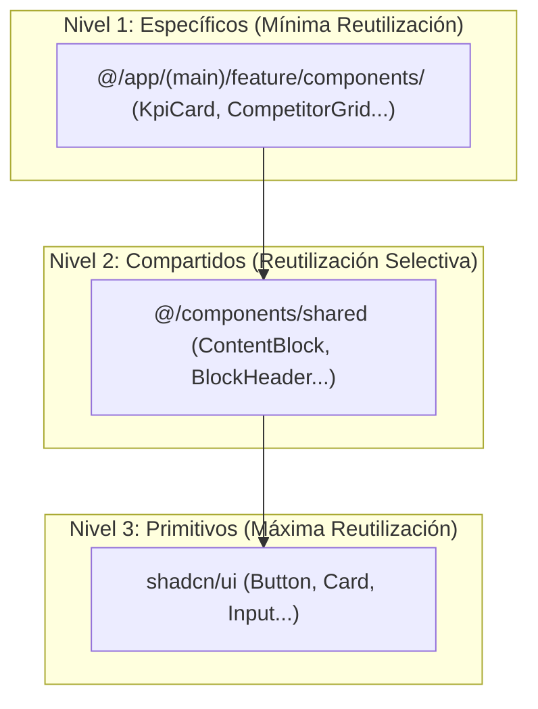

# Documento de Arquitectura y Decisiones (ADR) - Amplify AI

*Última actualización: Pivote estratégico a una arquitectura integrada con Next.js como framework full-stack y Supabase como BaaS (Backend as a Service).*

## 1. Filosofía y Visión General

Este documento describe la arquitectura full-stack del proyecto Amplify AI. La filosofía principal ha evolucionado de una estricta separación de frontend/backend a un **enfoque integrado que aprovecha Next.js como un framework full-stack**. Esta decisión estratégica nos permite un desarrollo más rápido, elimina la necesidad de un intermediario (API de FastAPI) para las operaciones CRUD estándar y aprovecha al máximo el ecosistema de Vercel y Supabase.

*   **Next.js (Capa de Presentación y Lógica de Datos):** Actúa como el núcleo de la aplicación. Es responsable de la experiencia de usuario, el renderizado de la interfaz y, crucialmente, de la **lógica de obtención y mutación de datos**. Las operaciones se realizan de forma segura en el servidor a través de Server Components y Server Actions.
*   **Supabase (Backend como Servicio - BaaS):** Proporciona todos los servicios de backend necesarios: una base de datos PostgreSQL, un sistema de autenticación robusto, almacenamiento de archivos y la capacidad de ejecutar funciones serverless. Es la fuente única de verdad para los datos.

---

## 2. Arquitectura Full-Stack

### 2.1. Diagrama de Arquitectura Global (Implementación Actual)

El anterior modelo de API intermediaria ha sido reemplazado por una comunicación directa y segura desde Next.js a Supabase.

```mermaid
graph TD
    subgraph "Usuario Final"
        A[Navegador del Usuario]
    end

    subgraph "Plataforma de Aplicación (Vercel)"
        B[Next.js App]
        B -- "Renderizado HTML y API Routes" --> A
        B -- "SQL sobre HTTPS (Cliente Supabase)" --> D
        B -- "API Calls Seguras (Server-Side)" --> E
    end

    subgraph "Backend como Servicio (BaaS) y Terceros"
        D[Supabase: DB (Postgres) + Auth + Storage]
        E[Stripe: Pagos y Suscripciones]
    end

    A -- "Interacciones (Client-Side)" --> B
```

### 2.2. Stack Tecnológico Detallado

| Capa      | Tecnología        | Propósito                                       |
|-----------|-------------------|-------------------------------------------------|
| **Aplicación**  | Next.js 14 (App Router) | Framework Full-Stack para UI, Renderizado y Lógica de Servidor. |
|           | TypeScript        | Tipado estático para robustez en todo el código.                  |
|           | Tailwind CSS      | Estilos a través de clases de utilidad.         |
|           | shadcn/ui         | Componentes de UI accesibles y personalizables. |
|           | Zustand           | Gestión de estado de cliente simple y reactiva. |
|           | Testing Library   | Pruebas de componentes y UI.                    |
| **BaaS** | Supabase          | Plataforma integrada de Backend como Servicio. |
|           | PostgreSQL        | Base de datos relacional para todos los datos de la aplicación. |
|           | Supabase Auth     | Gestión de usuarios (Social, Email/Pass) y JWT. |
|           | Supabase Storage  | Almacenamiento de archivos y assets de marca.       |
| **Pagos**     | Stripe            | Procesamiento de pagos y suscripciones.       |
| **CI/CD**     | GitHub Actions    | Automatización de pruebas y despliegues.      |
| **Hosting**   | Vercel            | Plataforma optimizada para el despliegue de Next.js.  |

---

## 3. Arquitectura de la Aplicación (Next.js)

El proyecto entero está estructurado para maximizar las capacidades del App Router de Next.js.

### 3.1. Flujo de Renderizado y Datos (Patrón de Servicio Directo a DB)

La decisión arquitectónica clave es la **abstracción de la capa de datos a través de un "Service Layer" que habla directamente con Supabase**.

1.  **Server Component (`/app/(main)/**/page.tsx`):**
    *   Una página es, por defecto, un **React Server Component (RSC)**.
    *   Orquesta la obtención de datos para la carga inicial llamando a una función del **Service Layer** (ej. `brandProfileService.getBrandProfile()`).
    *   No contiene JSX de presentación complejo. Pasa los datos obtenidos como `props` a un Client Component.

2.  **Service Layer (`/lib/services/*.ts`):**
    *   Este es el **único lugar** donde se define cómo obtener datos de Supabase. Cada servicio encapsula la lógica para un dominio específico (ej. `dashboardService.ts`, `settingsService.ts`).
    *   **Implementación Clave:** Las funciones dentro de estos servicios utilizan el cliente de Supabase para el servidor, creado con `@supabase/ssr`, para realizar consultas seguras a la base de datos. Este cliente lee automáticamente el token de sesión del usuario desde las cookies de la petición.

    ```typescript
    // Ejemplo: lib/services/brandProfileService.ts
    import { createSupabaseServerClient } from '@/lib/supabase/server';
    import { getCompanyId } from '@/lib/services/companyService'; // Otro servicio para obtener el company_id del usuario

    export const getBrandProfile = async () => {
      const supabase = createSupabaseServerClient();
      const companyId = await getCompanyId(supabase);

      const { data, error } = await supabase
        .from('companies')
        .select('brand_identity')
        .eq('id', companyId)
        .single();

      if (error) throw new Error('Failed to fetch brand profile.');
      return data.brand_identity;
    };
    ```

3.  **Client Component (`/app/(main)/**/components/*ClientPage.tsx`):**
    *   Marcado con `"use client"`.
    *   Recibe los datos iniciales como `props` desde el Server Component.
    *   Contiene toda la interactividad: estado (hooks), manejadores de eventos y renderizado de la UI.
    *   Para **mutaciones** (Crear, Actualizar, Borrar), idealmente invoca **Server Actions**, que a su vez llaman a las funciones del Service Layer para ejecutar la lógica en el servidor de forma segura.

### 3.2. Estructura de Directorios Clave

-   `app/(main)/*`: Rutas principales de la aplicación.
    -   `page.tsx`: El Server Component que carga los datos.
    -   `components/*ClientPage.tsx`: El Client Component que renderiza la UI.
-   `lib/services`: La capa de abstracción de datos. El único punto de comunicación con Supabase.
-   `lib/supabase`: Contiene la configuración de los clientes de Supabase para cliente (`client.ts`) y servidor (`server.ts`).
-   `lib/types.ts`: Definiciones de tipos de TypeScript compartidas.
-   `supabase/migrations`: Contiene los scripts SQL para la estructura y seeding de la base de datos. El "Master Setup Script" es la fuente de la verdad del esquema.

### 3.3. Estructura de Componentes (La Pirámide)

Para mantener el código organizado, escalable y con un bajo acoplamiento, los componentes se organizan en una jerarquía de tres niveles, conocida como "La Pirámide de Componentes". La regla principal es: **un componente debe residir en el nivel más específico posible**. La reciente implementación de la sección de **Ajustes (`/settings`)** es un caso de estudio perfecto de esta pirámide en acción.



**Nivel 1: Componentes Específicos de Feature (`/app/(main)/[feature]/components/`)**
- **Definición:** Son componentes que están fuertemente acoplados a una única funcionalidad o página de la aplicación.
- **Ejemplos:** `KpiCard` (solo para `analytics`), `CompetitorGrid` (solo para `strategy-coach`), o las pestañas completas de ajustes como `AccountTab.tsx` y `BillingTab.tsx`, que solo tienen sentido dentro de la ruta `/settings`.
- **Regla:** Si un componente solo se usa dentro de una *feature*, **DEBE** vivir en el directorio `components` de esa *feature*.

**Nivel 2: Componentes Compartidos (`/components/shared/`)**
- **Definición:** Componentes de composición que son reutilizados en **al menos dos features distintas**.
- **Ejemplos:** `PageHeader`, `DashboardSection` (utilizado para encapsular bloques de contenido en `Ajustes` y otras páginas), `FormField` (para crear campos de formulario consistentes) y `SettingsSaveFooter` (para los botones de guardar cambios).
- **Regla:** Un componente solo se puede "promocionar" a `shared` cuando se demuestra su necesidad en una segunda *feature*. No se deben crear componentes compartidos de forma especulativa.

**Nivel 3: Componentes Primitivos de UI (`/components/ui/`)**
- **Definición:** Son los bloques de construcción básicos y sin lógica de negocio, proporcionados por la librería `shadcn/ui`.
- **Ejemplos:** `Button`, `Card`, `Input`, `Dialog`.

### 3.4. Sistema de Diseño (Design Tokens)

Para asegurar la consistencia visual y facilitar el mantenimiento, la aplicación utiliza un sistema de Design Tokens centralizado.

-   **Fuente de la Verdad (Valores):** El archivo `app/globals.css` define todas las variables CSS para los colores, fuentes y radios de la aplicación. Crucialmente, contiene las definiciones para el tema claro (`:root`) y oscuro (`.dark`), permitiendo un theming robusto.

-   **Integración con Tailwind CSS:** El archivo `tailwind.config.ts` consume estas variables CSS. En lugar de valores harcodeados, la configuración del tema de Tailwind apunta a estas variables.
    -   *Ejemplo:* `colors: { primary: 'var(--primary)' }`

-   **Uso en la Práctica:** Los desarrolladores deben utilizar exclusivamente las clases de utilidad de Tailwind (ej. `bg-primary`, `text-foreground`, `border-border`) en los componentes. Esto desacopla los componentes de los valores de diseño específicos, permitiendo que un cambio en una variable CSS en `globals.css` se propague por toda la aplicación de manera consistente.

### 3.5. Arquitectura de Autenticación (`/app/(auth)`)

La autenticación no es solo una característica, sino un contexto arquitectónico distinto dentro de la aplicación.

-   **Layout de Grupo Dedicado:** Se utiliza un [Layout de Grupo](https://nextjs.org/docs/app/building-your-application/routing/route-groups) de Next.js, `(auth)`, para las páginas relacionadas con la autenticación (ej. `/login`, `/register`, `/forgot-password`). Este grupo tiene su propio `layout.tsx` que **NO** incluye los componentes del "Application Shell" como la `Sidebar` o el `Header`. Esto crea un entorno limpio y enfocado para el usuario.

-   **Páginas Orquestadoras:** Cada página dentro de `(auth)`, como `login/page.tsx`, actúa como un orquestador que compone la interfaz a partir de componentes de UI y, si es necesario, componentes de módulo más complejos.

-   **Componentes de Módulo Específicos:** Siguiendo el Nivel 1 de la "Pirámide de Componentes", la lógica visual compleja se aísla en su propio componente. Un ejemplo clave es `components/auth/OrbitalShowcase.tsx`, que encapsula toda la animación 3D de la página de login, manteniendo el archivo de la página limpio y enfocado en el estado y la lógica del formulario.

---

## 4. Arquitectura de Backend como Servicio (Supabase)

Hemos adoptado Supabase como nuestro backend integral, eliminando la necesidad de un servicio de API intermedio para la mayoría de las operaciones.

### 4.1. Componentes Utilizados

*   **Database (PostgreSQL):** El núcleo de nuestro sistema. Utilizamos un esquema relacional bien definido (`database-schema.md`) y aplicamos **Políticas de Seguridad a Nivel de Fila (RLS)** para asegurar que los usuarios solo puedan acceder a los datos de su propia compañía.
*   **Auth:** Gestiona todo el ciclo de vida del usuario. Usamos `supabase.auth.signUp()` y `signInWithPassword()`. La pieza central es el **trigger de base de datos `on_auth_user_created`** que automáticamente provisiona un nuevo perfil de usuario y una compañía por defecto al registrarse.
*   **Storage:** Se utilizará para almacenar los activos de marca (`brand_assets`) y los medios de las publicaciones (`posts`). El acceso también estará protegido por políticas de seguridad.

### 4.2. Flujo de una Petición Autenticada (Server-Side)

El flujo de autenticación es transparente y seguro gracias al paquete `@supabase/ssr`.

1.  El usuario inicia sesión. El cliente de Supabase en el navegador almacena de forma segura la sesión (incluyendo el JWT) en una **cookie**.
2.  En cada petición subsiguiente al servidor de Next.js (ya sea por navegación a una página o por una Server Action), esta cookie se envía automáticamente.
3.  Un Server Component o Server Action necesita acceder a datos. Llama a una función de nuestro **Service Layer**.
4.  Dentro del servicio, la función `createSupabaseServerClient()` se invoca. Esta función lee la cookie de la petición entrante y la utiliza para instanciar un cliente de Supabase que está **automáticamente autenticado como el usuario que realizó la petición**.
5.  El cliente de Supabase realiza la consulta a la base de datos (ej. `SELECT * FROM posts`).
6.  **Punto Clave de Seguridad:** La base de datos PostgreSQL, gracias a las RLS, evalúa la consulta en el contexto del `user_id` extraído del JWT. La política de RLS, por ejemplo, añade automáticamente una condición `WHERE company_id = (SELECT company_id FROM company_members WHERE user_id = auth.uid())`.
7.  Si el usuario tiene permiso, la base de datos devuelve los datos. Si no, devuelve un conjunto vacío o un error, protegiendo los datos de otros inquilinos.

Este modelo es extremadamente eficiente y seguro, ya que la lógica de autorización reside en la capa más cercana a los datos: la propia base de datos. 