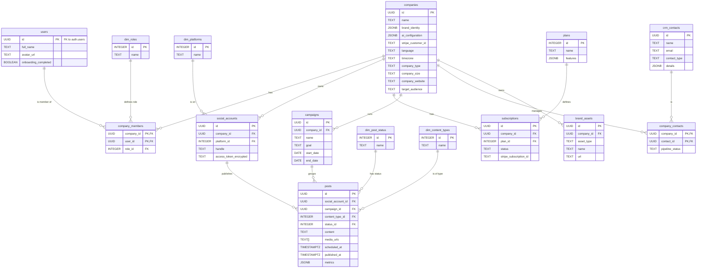

# Documentación Detallada del Esquema de Base de Datos - Amplify AI

## Visión General

Este documento describe la arquitectura de la base de datos PostgreSQL en Supabase para la aplicación Amplify AI. El diseño sigue un modelo de datos SaaS multi-inquilino, donde cada `Compañía` es la unidad central que agrupa a usuarios, recursos y datos. La seguridad se garantiza a través de Políticas de Seguridad a Nivel de Fila (RLS) que aíslan los datos de cada inquilino.

---

## Diagrama de Entidad-Relación (ERD)

A continuación se muestra un diagrama que visualiza las relaciones entre las principales tablas del sistema.



---

## Descripción Detallada de Tablas y Columnas

A continuación se detalla el propósito y la estructura de cada tabla.

### 1. Tablas de Dimensiones (`dim_`)
Estas tablas contienen datos categóricos que rara vez cambian. Sirven para normalizar la base de datos y asegurar la consistencia. Todas tienen una estructura similar.

-   **`dim_platforms`**: Plataformas de redes sociales.
-   **`dim_post_status`**: Estados posibles de una publicación.
-   **`dim_roles`**: Roles de usuario dentro de una compañía.
-   **`dim_content_types`**: Tipos de contenido publicable.
    -   `id` `SERIAL PRIMARY KEY`: Identificador único.
    -   `name` `TEXT NOT NULL UNIQUE`: Nombre de la categoría (ej: "Instagram", "Draft", "Owner").

### 2. Entidades Centrales (Core Entities)

-   **`users`**: Almacena el perfil público de un usuario.
    -   `id` `UUID PRIMARY KEY`: Referencia a `auth.users(id)`. **`ON DELETE CASCADE`** para que si se elimina un usuario de Auth, se elimine su perfil.
    -   `full_name` `TEXT`: Nombre completo del usuario, sincronizado desde los metadatos de Auth.
    -   `avatar_url` `TEXT`: URL del avatar del usuario, sincronizado desde los metadatos de Auth.
    -   `onboarding_completed` `BOOLEAN DEFAULT FALSE`: Bandera para indicar si el usuario ha completado el flujo de onboarding inicial.

-   **`companies`**: La entidad central (inquilino).
    -   `id` `UUID PRIMARY KEY`: Generado por `uuid_generate_v4()`.
    -   `name` `TEXT NOT NULL`: Nombre de la compañía, generado inicialmente desde el nombre del usuario (ej. "John Doe's Company").
    -   `created_at` `TIMESTAMPTZ DEFAULT NOW()`: Fecha de creación.
    -   `brand_identity` `JSONB`: Objeto JSON que contiene toda la identidad de marca definida.
        ```json
        {
          "golden_circle": { "why": "...", "how": "...", "what": "..." },
          "hero_journey": { "character": "...", "goal": "...", "obstacle": "..." },
          "archetypes": { "primary": "Creator", "secondary": "Sage" },
          "voice_and_tone": { "persona": "...", "tone_attributes": ["Inspirational", "Witty"] },
          "pillars": [ { "name": "Pillar 1", "description": "..." } ],
          "rituals": [ { "name": "Ritual 1", "description": "..." } ]
        }
        ```
    -   `ai_configuration` `JSONB`: Configuración específica de la IA para esta compañía.
        ```json
        {
          "creativity_level": 0.8,
          "target_platforms": ["Instagram", "LinkedIn"],
          "banned_keywords": ["keyword1", "keyword2"]
        }
        ```
    -   `stripe_customer_id` `TEXT UNIQUE`: ID del cliente en Stripe.
    -   `language`, `timezone`, `company_type`, `company_size`, `company_website`, `target_audience`: Campos de perfil adicionales.

-   **`company_members`**: Tabla de unión para la relación muchos-a-muchos entre usuarios y compañías.
    -   `company_id` `UUID`: Referencia a `companies(id)`. **`ON DELETE CASCADE`**.
    -   `user_id` `UUID`: Referencia a `users(id)`. **`ON DELETE CASCADE`**.
    -   `role_id` `INTEGER`: Referencia a `dim_roles(id)`.
    -   `PRIMARY KEY (company_id, user_id)`: Asegura que un usuario solo tenga un rol por compañía.

-   **`social_accounts`**: Cuentas de redes sociales vinculadas por una compañía.
    -   `id` `UUID PRIMARY KEY`: Generado por `uuid_generate_v4()`.
    -   `company_id` `UUID NOT NULL`: Referencia a `companies(id)`. **`ON DELETE CASCADE`**.
    -   `platform_id` `INTEGER NOT NULL`: Referencia a `dim_platforms(id)`.
    -   `handle` `TEXT NOT NULL`: El @nombredeusuario en la plataforma.
    -   `access_token_encrypted` `TEXT`: El token de acceso para la API de la plataforma, encriptado.
    -   `created_at` `TIMESTAMPTZ DEFAULT NOW()`: Fecha de vinculación.

### 3. Lógica de Negocio y Facturación

-   **`plans`**: Define los planes de suscripción.
    -   `id` `SERIAL PRIMARY KEY`.
    -   `name` `TEXT NOT NULL`.
    -   `features` `JSONB`: Describe las características del plan.
        ```json
        { "max_users": 5, "max_social_accounts": 10, "analytics": true }
        ```

-   **`subscriptions`**: La suscripción de una compañía a un plan.
    -   `id` `UUID PRIMARY KEY`: Generado por `uuid_generate_v4()`.
    -   `company_id` `UUID NOT NULL`: Referencia a `companies(id)`. **`ON DELETE CASCADE`**.
    -   `plan_id` `INTEGER NOT NULL`: Referencia a `plans(id)`.
    -   `status` `TEXT NOT NULL`: Estado de la suscripción (ej: "active", "canceled", "past_due").
    -   `ends_at` `TIMESTAMPTZ`: Fecha de finalización o renovación.
    -   `stripe_subscription_id` `TEXT UNIQUE`: ID de la suscripción en Stripe.

### 4. Marketing y Contenido

-   **`campaigns`**: Agrupaciones de publicaciones.
    -   `id` `UUID PRIMARY KEY`: Generado por `uuid_generate_v4()`.
    -   `company_id` `UUID NOT NULL`: Referencia a `companies(id)`. **`ON DELETE CASCADE`**.
    -   `name` `TEXT NOT NULL`: Nombre de la campaña.
    -   `goal`, `start_date`, `end_date`: Campos descriptivos de la campaña.

-   **`posts`**: Una pieza de contenido.
    -   `id` `UUID PRIMARY KEY`: Generado por `uuid_generate_v4()`.
    -   `social_account_id` `UUID NOT NULL`: Referencia a `social_accounts(id)`. **`ON DELETE CASCADE`**.
    -   `campaign_id` `UUID`: Referencia a `campaigns(id)`. **`ON DELETE SET NULL`** (si se borra la campaña, el post no se borra).
    -   `content_type_id` `INTEGER NOT NULL`: Referencia a `dim_content_types(id)`.
    -   `status_id` `INTEGER NOT NULL`: Referencia a `dim_post_status(id)`.
    -   `content` `TEXT`: El texto de la publicación.
    -   `media_urls` `TEXT[]`: Un array de URLs a imágenes o videos.
    -   `scheduled_at` `TIMESTAMPTZ NOT NULL`: Fecha/hora programada para la publicación.
    -   `published_at` `TIMESTAMPTZ`: Fecha/hora real de publicación (si ya fue publicado).
    -   `metrics` `JSONB`: Métricas de rendimiento obtenidas de la API de la plataforma.
        ```json
        { "likes": 120, "comments": 15, "shares": 5, "reach": 1500 }
        ```

### 5. CRM e Influencers

-   **`crm_contacts`**: Repositorio global de contactos.
    -   `id` `UUID PRIMARY KEY`: Generado por `uuid_generate_v4()`.
    -   `name` `TEXT NOT NULL`.
    -   `email` `TEXT UNIQUE`.
    -   `contact_type` `TEXT`: (ej. "Influencer", "Lead").
    -   `details` `JSONB`: Información adicional.
        ```json
        { "instagram_followers": 50000, "niche": "Fitness", "engagement_rate": 0.03 }
        ```

-   **`company_contacts`**: Vincula un contacto a una compañía.
    -   `company_id` `UUID NOT NULL`: Referencia a `companies(id)`. **`ON DELETE CASCADE`**.
    -   `contact_id` `UUID NOT NULL`: Referencia a `crm_contacts(id)`. **`ON DELETE CASCADE`**.
    -   `pipeline_status` `TEXT NOT NULL`: (ej. "Identified", "Contacted", "Negotiating").
    -   `PRIMARY KEY (company_id, contact_id)`.

### 6. Activos de Marca

-   **`brand_assets`**: Almacén de logos, imágenes, etc.
    -   `id` `UUID PRIMARY KEY`: Generado por `uuid_generate_v4()`.
    -   `company_id` `UUID NOT NULL`: Referencia a `companies(id)`. **`ON DELETE CASCADE`**.
    -   `asset_type` `TEXT NOT NULL`: (ej. "Logo", "Icon", "Brand Image").
    -   `name` `TEXT NOT NULL`.
    -   `url` `TEXT NOT NULL`: URL al archivo, probablemente en Supabase Storage.
    -   `created_at` `TIMESTAMPTZ DEFAULT NOW()`.

</rewritten_file> 