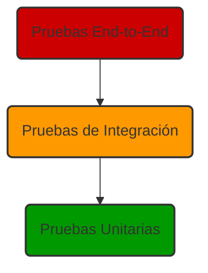

# 🧪 Estrategia de Pruebas

## 1. Filosofía: "Pruebas Pragmáticas para la Confianza del Desarrollador"

El objetivo de nuestras pruebas no es alcanzar el 100% de cobertura de código, sino **maximizar la confianza en que la aplicación funciona como se espera** con un esfuerzo razonable. Escribimos pruebas para evitar regresiones y para asegurar que las futuras refactorizaciones se puedan hacer con seguridad.

Nuestra estrategia se basa en la **Pirámide de Pruebas** y se centra en las **Pruebas de Integración de Componentes** como el punto de mayor retorno de inversión.



-   **Pruebas Unitarias (Pocas pero precisas):** Se usarán para funciones puras y aisladas, principalmente en `lib/utils.ts` o helpers de lógica de negocio complejos. Son rápidas y fáciles de escribir.
-   **Pruebas de Integración (La mayoría de nuestras pruebas):** Este es nuestro enfoque principal. Probamos componentes o grupos de componentes para verificar que se renderizan correctamente e interactúan entre sí según las `props` recibidas y las acciones del usuario. Usamos `React Testing Library` para esto.
-   **Pruebas End-to-End (Futuro):** Se implementarán en el futuro con herramientas como `Cypress` o `Playwright` para verificar los flujos de usuario más críticos (ej. Login -> Crear Post -> Cerrar Sesión).

## 2. Herramientas

-   **Framework de Pruebas:** `Jest`
-   **Librería de Renderizado y Eventos:** `React Testing Library`
-   **Aserciones:** `jest-dom` para aserciones de DOM más legibles (ej. `toBeInTheDocument()`).

## 3. Guía Práctica

### ¿Dónde colocar los archivos de prueba?
Para mantener los tests cerca de su código fuente, los archivos de prueba para un componente específico deben residir en un subdirectorio `__tests__` dentro de la carpeta del componente.

**Ejemplo:**
```
components/
└── shared/
    ├── StatCard.tsx
    └── __tests__/
        └── StatCard.test.tsx
```

### Convención de Nomenclatura
Los archivos de prueba deben seguir el formato: `[NombreComponente].test.tsx`.

### El Principio Guía de React Testing Library
**"Cuanto más se parezcan sus pruebas a la forma en que se utiliza su software, más confianza le darán."**

Esto significa que:
-   **No probamos detalles de implementación:** No nos importa el estado interno de un componente o el nombre de sus funciones.
-   **Consultamos el DOM como lo haría un usuario:** Buscamos texto, etiquetas, roles de accesibilidad, etc.
-   **Interactuamos como lo haría un usuario:** Simulamos clics, escritura en formularios, etc.

## 4. Ejemplo: Probando el Componente `StatCard`

A continuación, un ejemplo de cómo probar nuestro componente `StatCard.tsx`.

**Archivo: `components/shared/__tests__/StatCard.test.tsx`**

```typescript
import React from 'react';
import { render, screen } from '@testing-library/react';
import '@testing-library/jest-dom';
import { StatCard } from '../StatCard';
import { Users } from 'lucide-react';

describe('StatCard', () => {

  it('debe renderizar el título y el valor correctamente', () => {
    render(<StatCard title="Total de Usuarios" value="1,250" />);

    // Buscamos elementos por su texto, como lo haría un usuario
    expect(screen.getByText('Total de Usuarios')).toBeInTheDocument();
    expect(screen.getByText('1,250')).toBeInTheDocument();
  });

  it('debe mostrar el indicador de cambio positivo', () => {
    render(
      <StatCard
        title="Ingresos"
        value="$5,000"
        change="+10%"
        changeType="increase"
      />
    );
    
    const changeIndicator = screen.getByText('+10% vs. período anterior');
    expect(changeIndicator).toBeInTheDocument();
    expect(changeIndicator).toHaveClass('text-green-500');
  });

  it('no debe mostrar el indicador de cambio si no se proporciona', () => {
    render(<StatCard title="Proyectos" value="32" />);

    const changeIndicator = screen.queryByText(/vs\. período anterior/);
    expect(changeIndicator).not.toBeInTheDocument();
  });

  it('debe renderizar un icono cuando se proporciona', () => {
    render(<StatCard title="Icono" value="Sí" icon={<Users data-testid="user-icon" />} />);
    
    expect(screen.getByTestId('user-icon')).toBeInTheDocument();
  });

});
```
Esta estrategia establece una base sólida para construir una suite de pruebas robusta y mantenible. 